# HelpDeskBot Modular — Documentación Final

Bot de soporte técnico para Telegram construido en n8n con arquitectura modular.
Gestiona solicitudes de soporte a través de un flujo conversacional por estados,
con persistencia en Google Sheets.

---

## Datos del proyecto

| Elemento | Valor |
|---|---|
| Bot Telegram | @GipitiCampusito_bot |
| Nombre del bot | ShatGipiti |
| Plataforma | n8n Cloud (daante.app.n8n.cloud) |
| Base de datos | Google Sheets |
| Versión del workflow | v5 |

---

## Hojas de Google Sheets

**ID del documento:** `11mez7jn3PwLNTXOPf886BV-J0gdmNq3QcAU6rSJlf-o`

### USUARIOS
| Campo | Descripción |
|---|---|
| telegram_user | ID numérico de Telegram del usuario |
| nombre | Nombre del usuario |
| rol | `ADMIN` o `usuario` |
| activo | `TRUE` o `FALSE` |

Solo los usuarios con `activo = TRUE` pueden usar el bot.
Los usuarios con `rol = ADMIN` tienen acceso al menú de administración.

### SOLICITUDES
| Campo | Descripción |
|---|---|
| id_ticket | ID único generado automáticamente (`TK-timestamp`) |
| tipo | Soporte tecnico / Solicitud administrativa / Consulta general |
| prioridad | Alta / Media / Baja |
| descripcion | Texto libre ingresado por el usuario |
| estado | Abierto / En proceso / Cerrado |
| creado_por | telegram_user del creador |
| fecha_creacion | ISO 8601 |

### LOGS
| Campo | Descripción |
|---|---|
| timestamp | Fecha y hora de la acción |
| telegram_user | ID del usuario |
| pantalla | Estado en que se encontraba el usuario |
| opcion | Mensaje enviado por el usuario |
| resultado | Resultado de la acción |

### SESIONES
| Campo | Descripción |
|---|---|
| telegram_user | ID del usuario (clave de match) |
| pantalla_actual | Estado actual del usuario en el flujo |
| datos_temp | JSON con datos parciales del wizard en curso |
| updated_at | Última actualización |

Una fila por usuario. Se actualiza con `appendOrUpdate` usando `telegram_user` como match.

---

## Credenciales en n8n

| Credencial | ID | Nombre |
|---|---|---|
| Telegram | `0lHudLLWakXBxVyn` | Telegram account |
| Google Sheets | `X4YGEpoayl9yUuCt` | Google Sheets OAuth2 API |

---

## Estados del flujo conversacional

```
MENU         Menú principal. Punto de entrada y de retorno.
TIPO         Selección del tipo de solicitud (wizard paso 1)
PRIORIDAD    Selección de prioridad (wizard paso 2)
DESCRIPCION  Ingreso de descripción (wizard paso 3)
CONFIRMACION Confirmación antes de guardar (wizard paso 4)
CONSULTAR    Espera el ID de ticket a consultar
CONFIG       Menú de administración (solo ADMIN)
ESTADO_ID    Espera el ID de ticket a modificar (solo ADMIN)
ESTADO_NUEVO Espera el nuevo estado a asignar (solo ADMIN)
```

---

## Opciones del menú principal

| Opción | Función |
|---|---|
| 0 | Ayuda — muestra descripción de todas las opciones |
| 1 | Crear solicitud — inicia el wizard de 4 pasos |
| 2 | Consultar estado — busca un ticket por ID |
| 3 | Mis solicitudes — muestra las últimas 5 del usuario |
| 4 | Reportes — resumen por estado y prioridad |
| 5 | Configuración — perfil de usuario o menú admin |
| 9 | Cancelar — disponible en cualquier paso del wizard |

---

## Arquitectura de nodos

### Bloque 1 — Entrada y acceso
1. **Telegram Trigger** — punto de entrada
2. **Buscar Usuario** — consulta USUARIOS por `telegram_user`
3. **Verificar usuario activo** — IF: `activo = TRUE` y existe el usuario
4. **Mensaje sin acceso** — respuesta si el usuario no está autorizado

### Bloque 2 — Sesión y contexto
5. **Leer Sesiones** — consulta SESIONES por `telegram_user` (`alwaysOutputData: true`)
6. **Preparar contexto** — extrae `mensaje`, `chat_id`, `telegram_user`, `estado`, `datos` desde Trigger y Sesiones

### Bloque 3 — Enrutamiento
7. **Router de estado** — Switch con 9 salidas según `estado`:
   `MENU / TIPO / PRIORIDAD / DESCRIPCION / CONFIRMACION / CONSULTAR / CONFIG / ESTADO_ID / ESTADO_NUEVO`

### Bloque 4 — Rama MENU
8. **Validar opcion de menu** — IF: mensaje es 0/1/2/3/4/5
9. **Menu principal** — Switch con 6 salidas: Ayuda/Crear/Consultar/Mis/Reportes/Config
10. **Mostrar ayuda** — Code
11. **Opcion invalida menu** — Code

### Bloque 5 — Rama Crear solicitud (wizard)
12. **Iniciar creacion de solicitud** — Code: estado → TIPO
13. **Seleccion de tipo** — Switch: 1/2/3/9/extra
14. **Guardar tipo seleccionado** — Code: guarda tipo, estado → PRIORIDAD
15. **Cancelar y limpiar sesion** — Code: estado → MENU, datos → {}
16. **Tipo invalido** — Code: permanece en TIPO
17. **Guardar prioridad** — Code: valida, guarda prioridad, estado → DESCRIPCION
18. **Guardar descripcion** — Code: valida longitud, guarda descripcion, estado → CONFIRMACION
19. **Verificar confirmacion** — Code: 1=guardar / 2=editar / 9=cancelar / extra=invalido
20. **Guardar ticket?** — IF: `guardar_ticket = true`
21. **Registrar ticket** — Google Sheets Append en SOLICITUDES

### Bloque 6 — Rama Consultar por ID
22. **Iniciar consulta por ID** — Code: estado → CONSULTAR
23. **Buscar ticket por ID** — Google Sheets sin filtro (trae todos)
24. **Formatear consulta** — Code: busca el ID en el resultado, formatea o informa no encontrado

### Bloque 7 — Rama Mis solicitudes
25. **Leer mis tickets** — Google Sheets filtrado por `creado_por`
26. **Formatear mis tickets** — Code: deduplica, toma últimas 5, formatea lista

### Bloque 8 — Rama Reportes
27. **Leer tickets para reporte** — Google Sheets sin filtro
28. **Formatear reporte** — Code: cuenta por estado y prioridad

### Bloque 9 — Rama Configuración / Admin
29. **Leer perfil del usuario** — Google Sheets USUARIOS
30. **Evaluar perfil** — Code: si ADMIN → estado CONFIG, si no → muestra perfil
31. **Opciones de config** — Switch: 1=cambiar estado / 9=volver / extra=invalido
32. **Iniciar cambio de estado** — Code: estado → ESTADO_ID
33. **Salir de config** — Code: estado → MENU
34. **Opcion invalida config** — Code: permanece en CONFIG
35. **Guardar ID ticket para estado** — Code: guarda id en datos_temp, estado → ESTADO_NUEVO
36. **Seleccionar nuevo estado** — Switch: 1=Abierto / 2=En proceso / 3=Cerrado / 9=Cancelar / extra=invalido
37. **Preparar nuevo estado** — Code: resuelve texto del estado, prepara respuesta
38. **Actualizar estado** — Google Sheets Update en SOLICITUDES, match por `id_ticket`
39. **Cancelar cambio estado** — Code: estado → MENU
40. **Estado invalido** — Code: permanece en ESTADO_NUEVO

### Bloque 10 — Persistencia común (todas las ramas convergen aquí)
41. **Guardar en bitacora** — Google Sheets Append en LOGS
42. **Preparar envio** — Code: recupera `estado`, `datos`, `chat_id`, `respuesta` desde los nodos productores de cada rama
43. **Guardar sesion** — Google Sheets AppendOrUpdate en SESIONES, match por `telegram_user`
44. **Enviar respuesta** — Telegram: lee `chat_id` y `respuesta` desde `Preparar envio`

---

## Flujo de datos entre nodos

Todos los nodos Code de las ramas producen un JSON con este contrato mínimo:

```json
{
  "chat_id": "123456789",
  "telegram_user": "123456789",
  "estado": "MENU",
  "datos": {},
  "respuesta": "Texto que verá el usuario",
  "log_resultado": "descripcion_del_resultado"
}
```

El nodo `Preparar envio` es el punto de recuperación del contexto. Como los nodos
de Google Sheets no propagan el JSON anterior, este nodo recorre todos los nodos
productores en orden hasta encontrar uno que tenga `respuesta`, y reconstruye
el estado completo para que `Guardar sesion` y `Enviar respuesta` funcionen
correctamente.

---

## Decisión de diseño: sesión en Google Sheets vs RAM

El workflow usa Google Sheets para persistir la sesión en lugar de
`$getWorkflowStaticData('global')`. Esto garantiza que:

- La sesión sobrevive reinicios, deploys y períodos de inactividad del workflow
- Múltiples usuarios pueden tener sesiones independientes simultáneas
- El estado es auditable y puede modificarse manualmente si es necesario

---

## Cómo resetear un usuario

Si un usuario queda trabado en un estado intermedio, edita la hoja SESIONES
y cambia `pantalla_actual` a `MENU` y `datos_temp` a `{}` en su fila.

---

## Cómo agregar un nuevo usuario

En la hoja USUARIOS agrega una fila con:
- `telegram_user`: el ID numérico de Telegram (no el @username)
- `nombre`: nombre para mostrar
- `rol`: `usuario` o `ADMIN`
- `activo`: `TRUE`

---

## Orden recomendado para extender el bot

1. Agregar un nuevo estado al Router de estado (Switch)
2. Crear los nodos Code de la rama con el contrato de datos documentado arriba
3. Conectar la rama al nodo `Guardar en bitacora`
4. Agregar el nombre del nodo productor final a la lista `PRODUCTORES` en `Preparar envio`

---

## Diagrama del flujo de trabajo (n8n)

```mermaid
flowchart TD
    %% ─────────────────────────────────────────
    %% BLOQUE 1 — Entrada y acceso
    %% ─────────────────────────────────────────
    TG([📨 Telegram Trigger])
    BU[🔍 Buscar Usuario\nGoogle Sheets]
    VU{Verificar\nusuario activo?}
    MSA[❌ Mensaje sin acceso\nTelegram]

    TG --> BU --> VU
    VU -- "activo = FALSE" --> MSA
    VU -- "activo = TRUE" --> LS

    %% ─────────────────────────────────────────
    %% BLOQUE 2 — Sesión y contexto
    %% ─────────────────────────────────────────
    LS[📋 Leer Sesiones\nGoogle Sheets]
    PC[⚙️ Preparar contexto\nCode]

    LS --> PC

    %% ─────────────────────────────────────────
    %% BLOQUE 3 — Enrutamiento por estado
    %% ─────────────────────────────────────────
    RE{🔀 Router de estado\nSwitch}

    PC --> RE

    %% ─────────────────────────────────────────
    %% BLOQUE 4 — Rama MENU
    %% ─────────────────────────────────────────
    VOM{Validar opción\nde menú?}
    MP{Menu principal\nSwitch}
    AY[💬 Mostrar ayuda\nCode]
    OIM[⚠️ Opción inválida\nmenú — Code]

    RE -- "estado = MENU" --> VOM
    VOM -- válida --> MP
    VOM -- inválida --> OIM
    MP -- "0 Ayuda" --> AY
    MP -- "1 Crear" --> ICS
    MP -- "2 Consultar" --> ICID
    MP -- "3 Mis tickets" --> LMT
    MP -- "4 Reportes" --> LTR
    MP -- "5 Config" --> LPU

    %% ─────────────────────────────────────────
    %% BLOQUE 5 — Wizard crear solicitud
    %% ─────────────────────────────────────────
    ICS[🆕 Iniciar creación\nde solicitud — Code]
    ST{Selección de tipo\nSwitch}
    GTS[💾 Guardar tipo\nseleccionado — Code]
    CLS[🚫 Cancelar y limpiar\nsesión — Code]
    TI[⚠️ Tipo inválido\nCode]
    GP[💾 Guardar prioridad\nCode]
    GD[💾 Guardar descripción\nCode]
    VC[🔎 Verificar\nconfirmación — Code]
    GTK{Guardar ticket?\nIF}
    RT[💾 Registrar ticket\nGoogle Sheets]

    RE -- "estado = TIPO" --> ST
    RE -- "estado = PRIORIDAD" --> GP
    RE -- "estado = DESCRIPCION" --> GD
    RE -- "estado = CONFIRMACION" --> VC

    ICS --> GBL
    ST -- "1/2/3 tipo válido" --> GTS
    ST -- "9 cancelar" --> CLS
    ST -- inválido --> TI
    GTS --> GBL
    CLS --> GBL
    TI --> GBL
    GP --> GBL
    GD --> GBL
    VC --> GTK
    GTK -- "confirmar = true" --> RT
    GTK -- "no guardar" --> GBL
    RT --> GBL

    %% ─────────────────────────────────────────
    %% BLOQUE 6 — Consultar por ID
    %% ─────────────────────────────────────────
    ICID[🔎 Iniciar consulta\npor ID — Code]
    BTID[🔍 Buscar ticket\npor ID — Google Sheets]
    FC[📄 Formatear consulta\nCode]

    RE -- "estado = CONSULTAR" --> BTID
    ICID --> GBL
    BTID --> FC --> GBL

    %% ─────────────────────────────────────────
    %% BLOQUE 7 — Mis solicitudes
    %% ─────────────────────────────────────────
    LMT[📋 Leer mis tickets\nGoogle Sheets]
    FMT[📄 Formatear mis\ntickets — Code]

    LMT --> FMT --> GBL

    %% ─────────────────────────────────────────
    %% BLOQUE 8 — Reportes
    %% ─────────────────────────────────────────
    LTR[📊 Leer tickets\npara reporte — Google Sheets]
    FR[📄 Formatear\nreporte — Code]

    LTR --> FR --> GBL

    %% ─────────────────────────────────────────
    %% BLOQUE 9 — Config / Admin
    %% ─────────────────────────────────────────
    LPU[👤 Leer perfil\ndel usuario — Google Sheets]
    EP[⚙️ Evaluar perfil\nCode]
    OC{Opciones de config\nSwitch}
    ICE[🔧 Iniciar cambio\nde estado — Code]
    SC[↩️ Salir de config\nCode]
    OIC[⚠️ Opción inválida\nconfig — Code]
    GITE[💾 Guardar ID ticket\npara estado — Code]
    SNE{Seleccionar\nnuevo estado — Switch}
    PNE[⚙️ Preparar nuevo\nestado — Code]
    AE[💾 Actualizar estado\nGoogle Sheets]
    CCE[🚫 Cancelar cambio\nestado — Code]
    EI[⚠️ Estado inválido\nCode]

    RE -- "estado = CONFIG" --> OC
    RE -- "estado = ESTADO_ID" --> GITE
    RE -- "estado = ESTADO_NUEVO" --> SNE

    LPU --> EP --> GBL
    OC -- "1 cambiar estado" --> ICE
    OC -- "9 volver" --> SC
    OC -- inválida --> OIC
    ICE --> GBL
    SC --> GBL
    OIC --> GBL
    GITE --> GBL
    SNE -- "1 Abierto" --> PNE
    SNE -- "2 En proceso" --> PNE
    SNE -- "3 Cerrado" --> PNE
    SNE -- "9 cancelar" --> CCE
    SNE -- inválido --> EI
    PNE --> AE --> GBL
    CCE --> GBL
    EI --> GBL

    %% ─────────────────────────────────────────
    %% BLOQUE 10 — Persistencia común (convergencia)
    %% ─────────────────────────────────────────
    GBL[📝 Guardar en bitácora\nGoogle Sheets]
    PE[⚙️ Preparar envío\nCode]
    GS[💾 Guardar sesión\nGoogle Sheets]
    ER([📤 Enviar respuesta\nTelegram])

    AY --> GBL
    OIM --> GBL
    GBL --> PE --> GS --> ER

    %% ─────────────────────────────────────────
    %% Estilos por bloque
    %% ─────────────────────────────────────────
    classDef entrada    fill:#4A90D9,stroke:#2c5f8a,color:#fff
    classDef acceso     fill:#5BA85A,stroke:#3a7039,color:#fff
    classDef sesion     fill:#8E6BBF,stroke:#5e408a,color:#fff
    classDef router     fill:#E8A838,stroke:#b07820,color:#fff
    classDef menu       fill:#5BA85A,stroke:#3a7039,color:#fff
    classDef wizard     fill:#4A90D9,stroke:#2c5f8a,color:#fff
    classDef consulta   fill:#56B4A0,stroke:#337a6e,color:#fff
    classDef mistickets fill:#56B4A0,stroke:#337a6e,color:#fff
    classDef reportes   fill:#D97B4A,stroke:#a05020,color:#fff
    classDef config     fill:#BF6B6B,stroke:#8a3a3a,color:#fff
    classDef comun      fill:#888,stroke:#555,color:#fff
    classDef terminal   fill:#333,stroke:#111,color:#fff

    class TG,ER terminal
    class BU,VU,MSA acceso
    class LS,PC sesion
    class RE router
    class VOM,MP,AY,OIM menu
    class ICS,ST,GTS,CLS,TI,GP,GD,VC,GTK,RT wizard
    class ICID,BTID,FC consulta
    class LMT,FMT mistickets
    class LTR,FR reportes
    class LPU,EP,OC,ICE,SC,OIC,GITE,SNE,PNE,AE,CCE,EI config
    class GBL,PE,GS comun
```


