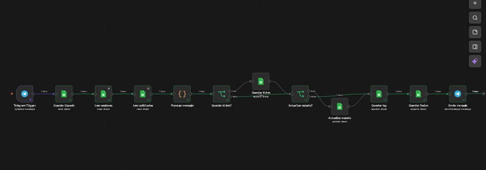
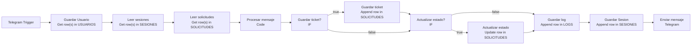

# HelpDeskBot - Documentacion Tecnica

Sistema de gestion de solicitudes internas de soporte a traves de Telegram, automatizado con n8n y persistido en Google Sheets.

## Vista general del flujo



## Tabla de contenido

1. Descripcion general
2. Objetivo del sistema
3. Arquitectura del sistema
4. Diagrama del flujo
5. Nodos principales del workflow
6. Modelo de datos
7. Flujo conversacional
8. Validaciones implementadas
9. Automatizaciones
10. Sesion y persistencia
11. Importacion del workflow
12. Credenciales requeridas
13. Consideraciones finales

## 1. Descripcion general

HelpDeskBot es un bot conversacional disenado para gestionar solicitudes internas de soporte, tales como incidentes tecnicos, solicitudes administrativas y consultas generales, mediante flujos conversacionales controlados y automatizacion basica.

El bot no toma decisiones autonomas ni aprende de los datos. Su funcion es organizar, registrar y presentar informacion, guiando al usuario mediante opciones numericas claras y mensajes humanizados.

La implementacion fue construida en la interfaz web de n8n usando nodos nativos de Telegram, Google Sheets, IF y Code. Por esa razon puede ejecutarse en n8n Cloud y tambien es portable a n8n Community Edition, siempre que se configuren las mismas credenciales.

## 2. Objetivo del sistema

El sistema fue desarrollado con los siguientes propositos:

- Centralizar el registro de solicitudes de soporte en una unica base de datos ligera.
- Ofrecer a los usuarios un canal estructurado en Telegram para reportar incidentes o hacer consultas.
- Garantizar que cada solicitud quede registrada con tipo, prioridad, descripcion, estado y fecha.
- Permitir la consulta del estado de tickets por ID.
- Mostrar solicitudes previas y reportes basicos desde el propio bot.
- Registrar en bitacora cada interaccion procesada.
- Permitir a un usuario con rol `admin` cambiar el estado de una solicitud.

## 3. Arquitectura del sistema

El sistema esta compuesto por tres capas:

- Capa de interfaz - Telegram
  El usuario interactua exclusivamente por mensajes de texto enviados al bot.

- Capa de logica - n8n
  n8n actua como motor de automatizacion. Cada mensaje entrante dispara el `Telegram Trigger`, se valida el usuario, se leen datos de sesion y solicitudes, y luego el nodo `Procesar mensaje` resuelve la pantalla actual y define la respuesta.

- Capa de persistencia - Google Sheets
  Google Sheets funciona como base de datos ligera. Se usan hojas para usuarios, solicitudes, logs y una hoja auxiliar de sesiones.

## 4. Diagrama del flujo



## 5. Nodos principales del workflow

El workflow final esta compuesto por 12 nodos principales:

| Nodo | Tipo | Funcion |
|---|---|---|
| Telegram Trigger | Telegram Trigger | Punto de entrada del workflow |
| Guardar Usuario | Google Sheets | Busca el usuario en `USUARIOS` |
| Leer sesiones | Google Sheets | Recupera el historial de sesion del usuario |
| Leer solicitudes | Google Sheets | Recupera solicitudes del usuario |
| Procesar mensaje | Code | Implementa la logica conversacional completa |
| Guardar ticket? | IF | Determina si se debe crear una nueva solicitud |
| Guardar ticket | Google Sheets | Inserta un nuevo ticket en `SOLICITUDES` |
| Actualizar estado? | IF | Determina si se debe cambiar el estado de un ticket |
| Actualizar estado | Google Sheets | Actualiza el estado de una solicitud existente |
| Guardar log | Google Sheets | Registra la interaccion en `LOGS` |
| Guardar Sesion | Google Sheets | Guarda el estado actual de la conversacion |
| Enviar mensaje | Telegram | Entrega la respuesta final al usuario |

## 6. Modelo de datos

El documento de Google Sheets utilizado es `HelpDeskBot_DB`.

### USUARIOS

Registra los usuarios habilitados para operar el bot.

| Campo | Descripcion |
|---|---|
| telegram_user | ID numerico del usuario en Telegram |
| nombre | Nombre visible del usuario |
| rol | Rol del usuario, por ejemplo `usuario` o `admin` |
| activo | Valor booleano o equivalente textual (`TRUE`, `1`, `SI`) |

### SOLICITUDES

Almacena los tickets creados por los usuarios.

| Campo | Descripcion |
|---|---|
| id_ticket | Identificador unico generado con prefijo `HD-` y timestamp |
| tipo | Soporte tecnico, Solicitud administrativa o Consulta general |
| prioridad | Alta, Media o Baja |
| descripcion | Texto descriptivo ingresado por el usuario |
| estado | Abierto, En proceso o Cerrado |
| creado_por | ID de Telegram del usuario creador |
| fecha_creacion | Fecha y hora en formato ISO 8601 |

### LOGS

Registra cada interaccion procesada.

| Campo | Descripcion |
|---|---|
| timestamp | Fecha y hora exacta de la ejecucion |
| telegram_user | ID del usuario |
| pantalla | Pantalla o estado conversacional resultante |
| opcion | Mensaje enviado por el usuario |
| resultado | Resultado del procesamiento |

### SESIONES

Hoja auxiliar utilizada para mantener el contexto conversacional entre mensajes.

| Campo | Descripcion |
|---|---|
| telegram_user | ID del usuario |
| pantalla_actual | Pantalla conversacional actual |
| datos_temp | Datos parciales serializados en JSON |
| updated_at | Fecha y hora de actualizacion |

## 7. Flujo conversacional

### Mensaje de bienvenida

Al escribir `/start` o cuando no existe contexto previo, el bot muestra el menu principal:

```text
Hola, soy HelpDeskBot

Estoy aqui para ayudarte con solicitudes de soporte
de forma rapida y ordenada.

Por favor escribe el numero de la opcion que quieras usar.

Menu principal:
0. Ayuda
1. Crear solicitud
2. Consultar estado de solicitud
3. Mis solicitudes
4. Reportes
5. Configuracion
```

### Opcion 0 - Ayuda

Muestra una descripcion corta de cada opcion disponible y recuerda el uso de `9` para cancelar durante flujos guiados.

### Opcion 1 - Crear solicitud

Implementa un wizard conversacional de cuatro pasos:

1. Tipo de solicitud
2. Prioridad
3. Descripcion
4. Confirmacion

Al confirmar, el bot genera el `id_ticket`, guarda la fila en `SOLICITUDES`, registra la interaccion y vuelve al menu.

### Opcion 2 - Consultar estado de solicitud

Solicita el `id_ticket` y muestra:

- ID
- Tipo
- Prioridad
- Descripcion
- Estado
- Fecha de creacion

### Opcion 3 - Mis solicitudes

Muestra hasta las ultimas 5 solicitudes del usuario. El workflow deduplica por `id_ticket` antes de formatear la respuesta para evitar repetir tickets de pruebas anteriores.

### Opcion 4 - Reportes

Presenta un resumen general calculado a partir de solicitudes unicas:

- Total
- Abiertas
- En proceso
- Cerradas
- Conteo por prioridad: Alta, Media y Baja

### Opcion 5 - Configuracion

Tiene dos comportamientos:

- Usuario normal:
  Muestra informacion de perfil (`telegram_user`, `nombre`, `rol`, `activo`).

- Usuario `admin`:
  Abre un submenu administrativo para cambiar el estado de una solicitud.

### Cambio de estado para admin

El flujo administrativo agrega tres pantallas conversacionales:

- `admin_config`
- `estado_id`
- `estado_nuevo`

Permite seleccionar un ticket e indicar el nuevo estado:

1. Abierto
2. En proceso
3. Cerrado

Luego ejecuta una operacion `Update row in sheet` sobre `SOLICITUDES`.

## 8. Validaciones implementadas

El sistema aplica las siguientes validaciones:

- Usuario activo: solo usuarios habilitados en la hoja `USUARIOS` pueden operar.
- Tipo valido: solo acepta `1`, `2`, `3` o `9` para cancelar.
- Prioridad valida: solo acepta `1`, `2`, `3` o `9` para cancelar.
- Descripcion obligatoria: requiere minimo 10 caracteres.
- Confirmacion explicita: el ticket solo se guarda cuando el usuario confirma.
- Rol admin: el cambio de estado solo esta disponible para usuarios con rol `admin`.
- Consulta segura: si no existe el `id_ticket`, el bot informa que no encontro la solicitud.

## 9. Automatizaciones

Las siguientes acciones se ejecutan automaticamente:

- Registro del ticket en `SOLICITUDES`.
- Asignacion del estado inicial `Abierto`.
- Cambio de estado a `Abierto`, `En proceso` o `Cerrado` cuando un admin lo solicita.
- Registro de cada interaccion en `LOGS`.
- Persistencia de pantalla y datos parciales en `SESIONES`.
- Notificacion inmediata por Telegram.
- Normalizacion de solicitudes por `id_ticket` para reportes y consultas.

## 10. Sesion y persistencia

El workflow no usa memoria interna de n8n para la sesion. En su lugar, utiliza la hoja `SESIONES`, lo cual ofrece dos ventajas:

- El estado conversacional queda visible y auditable en Google Sheets.
- El flujo puede continuar entre mensajes incluso si la ejecucion anterior ya termino.

Las pantallas manejadas por el nodo `Procesar mensaje` son:

- `menu`
- `tipo`
- `prioridad`
- `descripcion`
- `confirmacion`
- `consultar`
- `admin_config`
- `estado_id`
- `estado_nuevo`

## 11. Importacion del workflow

El workflow puede importarse desde un archivo JSON exportado de n8n, por ejemplo `ChatGipitiCampus.json`.

Pasos generales:

1. Abrir n8n en el navegador.
2. Crear un workflow nuevo o abrir uno vacio.
3. Seleccionar la opcion `Import from file`.
4. Elegir el archivo JSON del workflow.
5. Configurar credenciales de Telegram y Google Sheets.
6. Guardar y activar el workflow.

## 12. Credenciales requeridas

### Telegram API

Se necesita un bot creado con `@BotFather`.

Datos requeridos:

- Token del bot

Uso:

- `Telegram Trigger`
- `Enviar mensaje`

### Google Sheets OAuth2

Se necesita una credencial con acceso al documento `HelpDeskBot_DB`.

Uso:

- `Guardar Usuario`
- `Leer sesiones`
- `Leer solicitudes`
- `Guardar ticket`
- `Actualizar estado`
- `Guardar log`
- `Guardar Sesion`

## 13. Consideraciones finales

La solucion implementada cumple con el enfoque del enunciado: un bot guiado por opciones numericas, con validaciones claras y sin decisiones autonomas.

Aunque el workflow usa pocos nodos en comparacion con otros enfoques, la logica principal fue centralizada intencionalmente en el nodo `Procesar mensaje` para reducir complejidad visual, mantener consistencia del flujo y facilitar la modificacion del comportamiento conversacional en un solo punto.

En pruebas funcionales, el sistema permite:

- crear solicitudes,
- consultar tickets por ID,
- listar solicitudes propias,
- mostrar reportes,
- ver configuracion,
- cambiar estados con rol `admin`,
- registrar logs y sesion de forma automatica.
